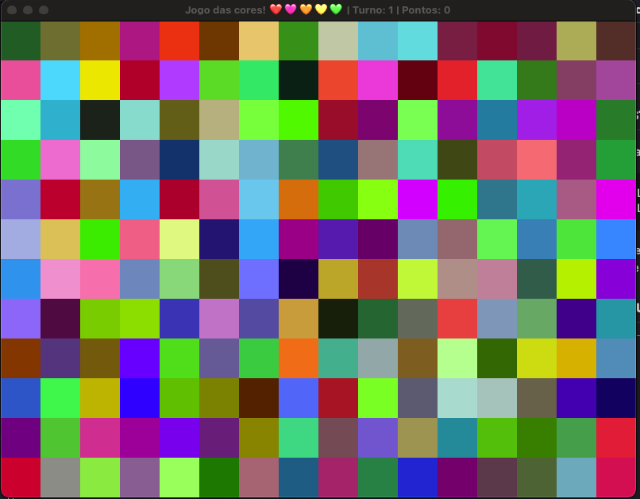
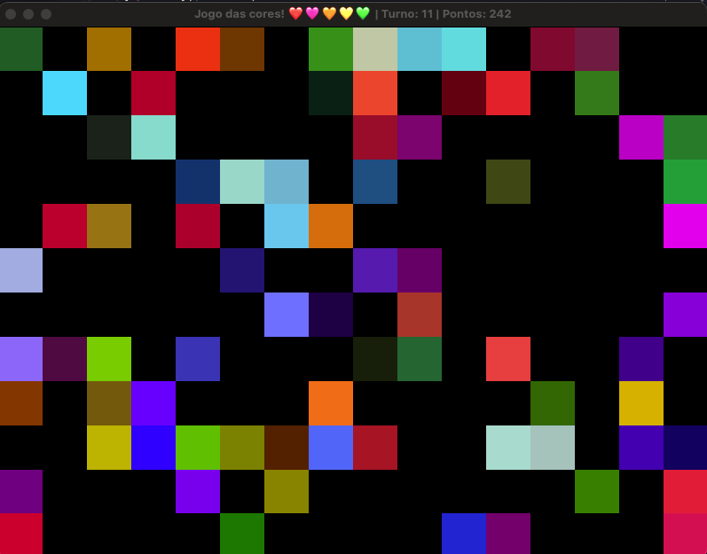
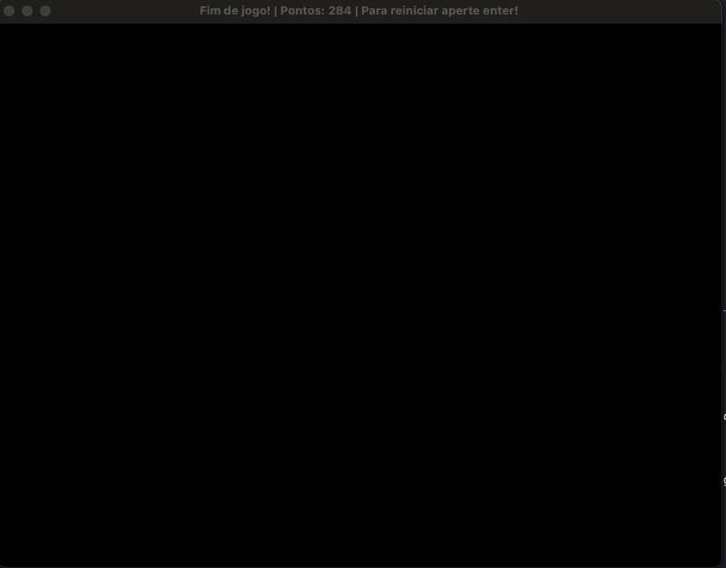
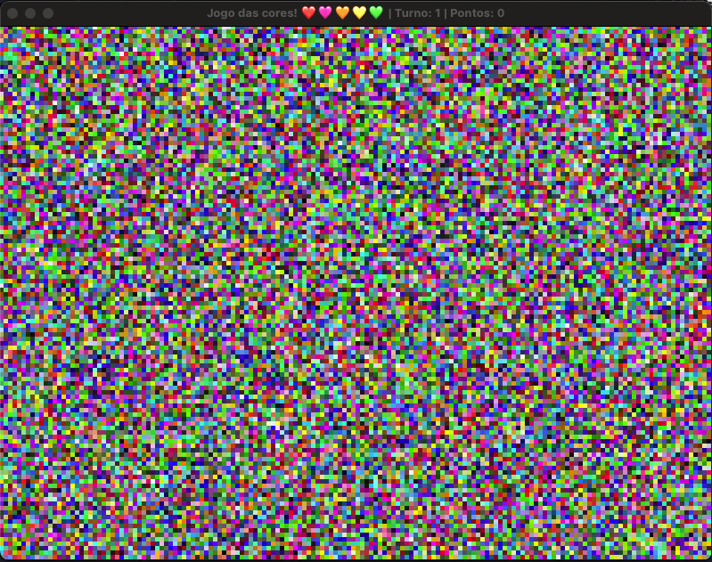

# 🎮 Jogo das Cores

> Feito por Eduardo Augusto Kuhn

## Informações do desenvolvimento

Eu fiz o jogo com base no arquivo M3JogosCores.cpp encontrado nesse [repositório](https://github.com/fellowsheep/PGCCHIB). A estrutura pra montar o grid não foi modificado, eu fiz pequenos ajustes para deixar o jogo funcional e refatorei um pouco o código pra deixar ele mais limpo. Os ajustes que eu realize são:

- Cálculo da pontuação (Falo um pouco mais nas regras do jogo);
- Criação de uma função para controlar a inicialização/reinicialização do jogo;
- Deixei algumas constantes dependendo de outras para poder deixar o jogo mais dinamico com quadrados de tamanhos diferentes;
- Criação de algumas variáveis para o controle de pontuação e turno;
- Fiz uma validação para ver se o jogo já acabou para mudar o nome do titulo da página;
- Na função `eliminarSimilares()` eu adicionei um contador para saber quantos quadrados foram eliminados;

## 🧠 Conceito do Jogo

O jogo apresenta uma grade de quadrados coloridos gerados aleatoriamente. O jogador deve clicar em um quadrado, e todos os quadrados com cores semelhantes (dentro de uma tolerância definida) são eliminados. A pontuação é calculada com base no número de quadrados eliminados e no turno atual.

---

## 📦 Estrutura do Projeto

- `main()`: Função principal que configura o OpenGL e executa o loop do jogo.
- `inicializaJogo()`: Inicializa ou reinicializa a grade de quadrados com cores aleatórias e reseta o estado do jogo.
- `eliminarSimilares()`: Elimina quadrados com cores próximas da cor selecionada e retorna quantos foram eliminados.
- `key_callback()`: Fecha o jogo (ESC) ou reinicia (ENTER).
- `mouse_button_callback()`: Detecta o clique do mouse e seleciona o quadrado clicado.
- `setupShader()`: Compila e configura os shaders.
- `createQuad()`: Cria o modelo do quadrado para renderização.

---

## 🎯 Regras do Jogo

- Clique em um quadrado para eliminá-lo e todos os outros com cor semelhante.
- A **tolerância de similaridade** é definida por um valor (`0.2`) normalizado com base na distância máxima de cor (euclidiana).
- A **pontuação** depende da quantidade de quadrados eliminados e do turno atual:
  ```
  Pontuação do turno = (quantidade eliminada * 10) / turno
  ```
  Isso significa que quanto mais cedo você eliminar, maior a pontuação.
- O **título da janela** indica o progresso do jogo:
  - Em jogo: `"Jogo das cores! ❤️🩷🧡💛💚 | Turno: X | Pontos: Y"`
  - Fim do jogo: `"Fim de jogo! | Pontos: Z | Para reiniciar aperte enter!"`

---

## 🧪 Controles

| Tecla / Ação        | Função                                                    |
| ------------------- | --------------------------------------------------------- |
| **Clique esquerdo** | Elimina quadrados semelhantes ao clicado e avança o turno |
| **ENTER**           | Reinicia o jogo                                           |
| **ESC**             | Fecha o jogo                                              |

---

## 🛠️ Constantes Dinâmicas

Você pode ajustar facilmente a configuração da grade alterando:

```cpp
const GLuint WIDTH = 800, HEIGHT = 600;
const GLuint QUAD_WIDTH = 50, QUAD_HEIGHT = 50;
```

Esses valores controlam a resolução da janela e o tamanho dos quadrados, impactando diretamente no número de linhas (`ROWS`) e colunas (`COLS`) da grade.

## 📸 Captura de Tela





